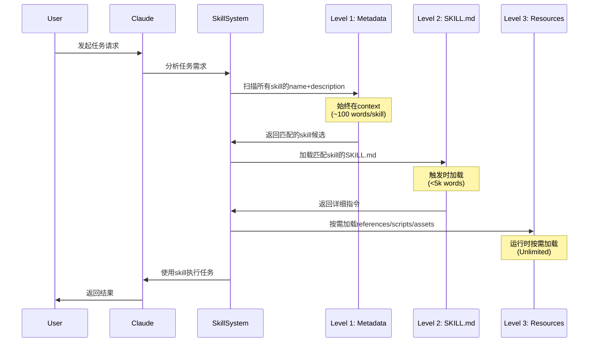

# Compound知识复利沉淀与Skill召回机制深度分析

## 📋 执行摘要

本文档深入分析 **Compound Engineering Plugin** 中的知识复利(compound)机制，与Skill召回机制的对比，以及如何实现"像skill一样自动召回"的愿景。

**核心发现**:
1. ✅ **Compound机制已存在** - `/workflow:compound` 命令和 `compound-docs` skill
2. ⚠️ **召回机制部分缺失** - 知识沉淀了，但自动召回能力有限
3. 🎯 **改进路径清晰** - 需要建立知识索引和主动召回机制

---

## 1️⃣ 当前Compound知识沉淀机制分析

### 1.1 核心工作流程

```mermaid
flowchart TB
    SOLVE[问题已解决] --> TRIGGER{触发compound}
    TRIGGER -->|自动| AUTO[检测到: that worked, it's fixed等]
    TRIGGER -->|手动| MANUAL[/workflow:compound]
    
    AUTO --> PARALLEL
    MANUAL --> PARALLEL
    
    subgraph PARALLEL[6个并行子代理]
        CA[Context Analyzer<br/>上下文分析]
        SE[Solution Extractor<br/>方案提取]
        RDF[Related Docs Finder<br/>关联文档]
        PS[Prevention Strategist<br/>预防策略]
        CC[Category Classifier<br/>分类器]
        DW[Documentation Writer<br/>文档编写]
    end
    
    PARALLEL --> VALIDATE[YAML Schema验证]
    VALIDATE --> OUTPUT[docs/solutions/<br/>category/slug.md]
    
    OUTPUT --> DECISION{决策菜单}
    DECISION -->|1| CONTINUE[继续工作流]
    DECISION -->|2| CRITICAL[添加到必读模式<br/>cora-critical-patterns.md]
    DECISION -->|3| LINK[关联相关问题]
    DECISION -->|4| EXISTING_SKILL[添加到现有Skill]
    DECISION -->|5| NEW_SKILL[创建新Skill]
    
    style OUTPUT fill:#e8f5e9
    style CRITICAL fill:#fff3e0
    style NEW_SKILL fill:#e1f5fe
```

### 1.2 知识沉淀的三个层次

| 层次 | 位置 | 作用 | 自动召回能力 |
|------|------|------|-------------|
| **L1: 解决方案文档** | `docs/solutions/category/*.md` | 问题症状、根因、解决方案 | ⚠️ 被动查找 |
| **L2: 必读模式** | `docs/solutions/patterns/cora-critical-patterns.md` | 提炼为❌/✅对比模式 | ✅ 所有代理生成前查看 |
| **L3: Skill化** | `plugins/compound-engineering/skills/[skill-name]/` | 完整技能包(SKILL.md + 资源) | ✅ 强召回 |

**发现**: 存在三级知识沉淀路径，但**只有L2和L3有主动召回**。

---

## 2️⃣ Skill召回机制深度解构

### 2.1 Skill的自动发现与召回流程



### 2.2 Skill召回的关键要素

#### ✅ **已实现的召回机制**

1. **Progressive Disclosure (渐进式披露)**
   ```yaml
   Level 1: name + description  # 始终在context (所有skills)
   Level 2: SKILL.md body       # 触发时加载 (<5k words)
   Level 3: Bundled resources   # 按需加载 (Unlimited)
   ```

2. **多源发现路径** (来自`deepen-plan.md`的设计)
   ```bash
   # 1. 项目本地skills (最高优先级)
   .claude/skills/
   
   # 2. 用户全局skills
   ~/.claude/skills/
   
   # 3. compound-engineering plugin skills
   ~/.claude/plugins/cache/*/compound-engineering/*/skills/
   
   # 4. 所有已安装插件的skills
   find ~/.claude/plugins/cache -type d -name "skills"
   ```

3. **触发机制**
   - **描述匹配**: skill的description包含任务关键词
   - **显式调用**: 命令或代理直接路由到skill (如 `/workflow:compound` → `compound-docs`)
   - **动态匹配**: 运行时扫描所有skills并匹配 (见`deepen-plan.md` Step 2)

---

## 3️⃣ Compound知识 vs Skill召回 - 核心差异

### 3.1 对比表

| 维度 | Compound知识 (docs/solutions/) | Skill机制 |
|------|-------------------------------|----------|
| **格式** | Markdown文档 (YAML frontmatter) | SKILL.md + 资源包 |
| **组织** | 按问题类型分类 (9个category目录) | 按能力域分类 (14个skill目录) |
| **元数据** | 丰富 (problem_type, component, symptoms, root_cause等) | 简洁 (name, description) |
| **自动发现** | ❌ 无 - 需要手动搜索或被引用 | ✅ 有 - name/description始终在context |
| **主动召回** | ❌ 仅被动查找 (`grep`, `find`) | ✅ 主动匹配任务 |
| **触发时机** | 需人工记忆/搜索,或被其他流程引用 | 任务关键词自动触发 |
| **可执行性** | 文档性 - 需人工应用 | 可执行 - SKILL.md包含指令,scripts可直接运行 |
| **复用场景** | 解决相同/类似问题时参考 | 执行相同类型任务时自动应用 |

### 3.2 关键洞察

**Compound知识的本质**: 
- 📚 **被动知识库** - 高质量文档,但需要"记得去查"
- 🎯 **结构化经验** - YAML schema保证一致性和可索引性

**Skill的本质**:
- 🤖 **主动代理扩展** - AI主动发现并使用
- 🔧 **可执行工具包** - 不只是文档,还包含脚本和模板

**问题所在**:
> Compound机制沉淀了高质量知识,但**缺少像Skill那样的自动发现和召回层**。

---

## 4️⃣ 实现"像Skill一样召回" - 技术路径

### 4.1 方案A: 将Compound知识Skill化 (推荐 ⭐)

#### 设计思路

创建一个**元Skill**: `compound-knowledge-retriever`

```
skills/compound-knowledge-retriever/
├── SKILL.md                    # 核心检索逻辑
├── scripts/
│   ├── index_solutions.py      # 索引构建脚本
│   ├── semantic_search.py      # 语义搜索
│   └── retrieve_relevant.py    # 相关文档召回
├── references/
│   ├── solution_index.json     # 自动生成的索引
│   └── category_taxonomy.yaml  # 分类体系
└── assets/
    └── search_prompt_template.md
```

#### SKILL.md 核心逻辑

```markdown
---
name: compound-knowledge-retriever
description: Automatically retrieve relevant documented solutions from docs/solutions/ when encountering similar problems, patterns, or implementation tasks. Prevents repeating past mistakes by surfacing institutional knowledge.
allowed-tools:
  - Read
  - Bash
preconditions:
  - docs/solutions/ directory exists with categorized solution files
---

# Compound Knowledge Retriever

## Purpose
Proactively search and surface relevant past solutions when:
- Encountering errors or bugs
- Planning implementations that might have pitfalls
- Reviewing code for common anti-patterns

## Automatic Triggering

This skill should activate when Claude detects:
- Error messages or stack traces
- Planning tasks involving [technologies in past solutions]
- Code review requests
- Architecture design discussions

## Retrieval Process

### Step 1: Index Check
- Load `references/solution_index.json` (auto-generated index)
- If index is stale (>24h), rebuild with `scripts/index_solutions.py`

### Step 2: Query Construction
Extract from current context:
- Technologies mentioned (e.g., Rails, React, PostgreSQL)
- Problem symptoms (error messages, performance issues)
- Components involved (models, controllers, APIs)

### Step 3: Search Strategy
Run parallel searches:
1. **Exact match**: Error message in symptoms field
2. **Tag match**: Technologies/patterns in tags field
3. **Category match**: problem_type aligned with current task
4. **Semantic search**: `scripts/semantic_search.py` for similar issues

### Step 4: Relevance Filtering
For each candidate solution:
- Check YAML frontmatter tags vs. current task
- Score by similarity (0-100)
- Return top 3-5 most relevant

### Step 5: Present Findings
Format as:
```
📚 Relevant Past Solutions Found:

1. [Title from YAML] (Similarity: 95%)
   - Root Cause: [root_cause field]
   - Quick Fix: [one-line summary of solution]
   - Full Doc: docs/solutions/[path]
   
2. [...]
```

### Step 6: Apply or Reference
- If highly relevant (>90%), proactively suggest applying the solution
- If moderately relevant (60-89%), mention as context
- Always link to full documentation for details
```

#### 实现细节

**索引构建脚本** (`scripts/index_solutions.py`):
```python
#!/usr/bin/env python3
import os
import yaml
import json
from pathlib import Path

def build_index(solutions_dir="docs/solutions"):
    index = {"solutions": [], "metadata": {}}
    
    for md_file in Path(solutions_dir).rglob("*.md"):
        with open(md_file, 'r') as f:
            content = f.read()
            # Extract YAML frontmatter
            if content.startswith('---'):
                yaml_end = content.find('---', 3)
                frontmatter = yaml.safe_load(content[3:yaml_end])
                
                index["solutions"].append({
                    "path": str(md_file),
                    "category": md_file.parent.name,
                    "metadata": frontmatter,
                    "search_text": " ".join([
                        frontmatter.get("module", ""),
                        frontmatter.get("problem_type", ""),
                        " ".join(frontmatter.get("tags", [])),
                        " ".join(frontmatter.get("symptoms", []))
                    ]).lower()
                })
    
    index["metadata"]["total_solutions"] = len(index["solutions"])
    index["metadata"]["last_updated"] = str(datetime.now())
    
    with open("skills/compound-knowledge-retriever/references/solution_index.json", 'w') as f:
        json.dump(index, f, indent=2)
    
    print(f"✓ Indexed {len(index['solutions'])} solutions")

if __name__ == "__main__":
    build_index()
```

#### 集成到现有工作流

**在关键命令中主动调用**:

1. **`/workflow:plan`** - 规划前查找相关解决方案,避免已知陷阱
   ```markdown
   # 在 spec-flow-analyzer 之前
   - 调用 compound-knowledge-retriever
   - 搜索与功能相关的past solutions
   - 将findings注入到plan的"Considerations"部分
   ```

2. **`/deepen-plan`** - Step 3已有learnings发现逻辑,增强为使用此skill
   ```markdown
   # 替换当前的find + head逻辑
   - 使用 compound-knowledge-retriever skill
   - 自动过滤和相关性评分
   - 并行spawn sub-agents for top matches
   ```

3. **`/workflow:work`** - 开发过程中遇到错误时自动查找
   ```markdown
   # Phase 2执行中,检测到错误时
   - 自动触发 compound-knowledge-retriever
   - 搜索error message in symptoms
   - 展示past solutions before debugging
   ```

4. **`/workflow:review`** - 审查时检查是否重复已知问题
   ```markdown
   # 在14个review agents之后
   - 运行 compound-knowledge-retriever
   - 检查代码变更是否触发已知anti-patterns
   - 标记为P2/P3 todos if applicable
   ```

---

### 4.2 方案B: 增强deepen-plan的Learning召回 (快速方案)

**当前状态** (deepen-plan.md, lines 145-267):
- ✅ 已有learnings发现逻辑
- ⚠️ 基于简单的file scan + frontmatter filtering
- ⚠️ 需要手动调用 `/deepen-plan`

**增强路径**:

1. **自动化索引**
   - 在 `compound-docs` skill的Step 6 (Create Documentation)后
   - 自动运行索引更新脚本
   - 维护 `.claude/artifacts/solutions-index.json`

2. **主动召回触发**
   - 修改 `/workflow:plan` 的 `spec-flow-analyzer`
   - 在生成plan前自动搜索relevant learnings
   - 注入到plan的initial research section

3. **优化过滤逻辑**
   ```python
   # 当前: 简单的tag/category字符串匹配
   # 改进: 加入相似度评分
   def calculate_relevance(learning_metadata, plan_context):
       score = 0
       # Tag overlap (0-40分)
       common_tags = set(learning_metadata['tags']) & set(plan_context['technologies'])
       score += len(common_tags) * 10
       
       # Category match (0-30分)
       if learning_metadata['category'] in plan_context['domains']:
           score += 30
       
       # Symptom keyword match (0-30分)
       for symptom in learning_metadata['symptoms']:
           if any(kw in symptom.lower() for kw in plan_context['keywords']):
               score += 10
       
       return min(score, 100)
   ```

---

### 4.3 方案C: 创建专门的Knowledge Agent

**设计**: 一个新的research agent: `institutional-knowledge-researcher`

```
agents/research/institutional-knowledge-researcher.md
```

**核心职责**:
- 在planning和review阶段被显式调用
- 搜索 `docs/solutions/` 和 critical patterns
- 返回结构化的"lessons learned"

**调用点**:
- `/workflow:plan` - 作为第4个并行research agent
- `/workflow:review` - 作为第15个review agent
- `/deepen-plan` - 在Step 5中显式调用

**优势**:
- 无需修改现有skill结构
- 可以与其他agents并行运行
- 明确的职责边界

**劣势**:
- 不是"自动召回",仍需要workflow显式调用
- 需要在多个命令中重复集成

---

## 5️⃣ 推荐实施路线图

### Phase 1: 快速增强 (1-2天)

**目标**: 让现有的compound知识在关键环节被主动召回

1. ✅ **创建索引脚本**
   - `scripts/index_solutions.py` - 扫描 `docs/solutions/` 生成JSON索引
   - 在 `compound-docs` skill的Step 7后自动运行

2. ✅ **增强 `/deepen-plan`**
   - 替换Step 3的手动file scan为索引查询
   - 加入相似度评分逻辑
   - 优先召回高分learnings

3. ✅ **集成到 `/workflow:plan`**
   - 在 `spec-flow-analyzer` 之前
   - 自动搜索relevant solutions
   - 注入到plan的"Known Pitfalls"部分

### Phase 2: Skill化 (3-5天)

**目标**: 创建完整的 `compound-knowledge-retriever` skill

1. ✅ **创建Skill结构**
   - SKILL.md with clear triggering logic
   - scripts/ for indexing and search
   - references/ for generated index
   - 使用 `skill-creator` skill辅助创建

2. ✅ **实现语义搜索** (可选,高级)
   - 使用轻量级embedding (如sentence-transformers)
   - 或基于关键词TF-IDF
   - 提升召回准确率

3. ✅ **集成到所有核心workflows**
   - `/workflow:plan` - pre-planning
   - `/workflow:work` - error detection
   - `/workflow:review` - anti-pattern check
   - `/deepen-plan` - learnings discovery

### Phase 3: 智能化 (长期优化)

**目标**: 主动学习和推荐

1. ✅ **自动模式提取**
   - 当相同root_cause出现3+次
   - 自动提示升级为critical pattern (L2)
   - 或建议创建新skill (L3)

2. ✅ **使用统计**
   - 追踪每个solution被召回的次数
   - 高频solutions自动提权
   - 过时solutions标记deprecation

3. ✅ **跨项目知识共享** (可选)
   - Export/import solution packages
   - 社区knowledge marketplace
   - Privacy-aware sharing (脱敏)

---

## 6️⃣ 实施示例

### 示例1: 规划阶段自动召回

**场景**: 用户运行 `/workflow:plan` 创建"Add Redis caching to API"

**当前行为**:
```
1. repo-research-analyst: 分析仓库
2. best-practices-researcher: 搜索Redis最佳实践
3. framework-docs-researcher: 查询Rails cache文档
4. spec-flow-analyzer: 生成plan
→ 输出: plans/add-redis-caching.md
```

**增强后行为**:
```
0. compound-knowledge-retriever: 搜索docs/solutions/
   → 发现: docs/solutions/performance-issues/redis-cache-stampede.md
   → 发现: docs/solutions/configuration-fixes/redis-connection-pool.md
   → Relevance: 95%, 88%

1. repo-research-analyst: 分析仓库
2. best-practices-researcher: 搜索Redis最佳实践
3. framework-docs-researcher: 查询Rails cache文档

4. spec-flow-analyzer: 生成plan
   → 自动注入section:
   
   ## Known Pitfalls (from Past Solutions)
   
   ⚠️ Cache Stampede Risk (95% relevance)
   - Past Issue: docs/solutions/performance-issues/redis-cache-stampede.md
   - Mitigation: Use `race_condition_ttl` in Rails.cache.fetch
   
   ⚠️ Connection Pool Exhaustion (88% relevance)
   - Past Issue: docs/solutions/configuration-fixes/redis-connection-pool.md
   - Mitigation: Configure pool size based on worker count
   
→ 输出: plans/add-redis-caching.md (with embedded learnings)
```

**效果**:
- ✅ 避免重复过去的错误
- ✅ Plan质量提升 - 包含proven mitigations
- ✅ 节省debugging时间

---

### 示例2: 开发阶段错误召回

**场景**: `/workflow:work` 执行中遇到错误

```ruby
# User is implementing caching
Rails.cache.fetch(key) do
  expensive_query
end

# Error appears:
Redis::TimeoutError: Connection timeout
```

**当前行为**:
```
User看到error → 手动debugging → Google搜索 → 试错
→ 20分钟后解决
```

**增强后行为**:
```
1. compound-knowledge-retriever自动触发
2. 搜索error message: "Redis::TimeoutError"
3. 召回: docs/solutions/configuration-fixes/redis-connection-pool.md

📚 Relevant Past Solution Found:

**Redis Connection Pool Timeout** (Exact Match: 100%)
- Root Cause: Default pool size (5) too small for worker count
- Quick Fix: Set REDIS_POOL_SIZE env var to match worker threads
- Tested Solution:
  ```ruby
  # config/initializers/redis.rb
  Redis.new(
    url: ENV['REDIS_URL'],
    pool_size: ENV.fetch('REDIS_POOL_SIZE', 20).to_i
  )
  ```
- Full Documentation: docs/solutions/configuration-fixes/redis-connection-pool.md

Apply this solution? [Y/n]

→ User: Y
→ Claude自动应用fix
→ 2分钟解决 (vs 20分钟)
```

**效果**:
- ✅ 10x时间节省
- ✅ 一致性 - 使用proven solution
- ✅ Knowledge复利体现 - 第一次30分钟,记录5分钟,之后每次2分钟

---

## 7️⃣ 技术实现细节

### 7.1 索引Schema设计

```json
{
  "version": "1.0",
  "last_updated": "2026-01-17T14:00:00Z",
  "total_solutions": 15,
  "solutions": [
    {
      "id": "perf-001",
      "path": "docs/solutions/performance-issues/redis-cache-stampede.md",
      "category": "performance_issue",
      "metadata": {
        "module": "API",
        "date": "2025-11-10",
        "problem_type": "performance_issue",
        "component": "database",
        "symptoms": [
          "Sudden spike in database queries",
          "Cache miss storm"
        ],
        "root_cause": "missing_race_condition_handling",
        "resolution_type": "code_fix",
        "severity": "high",
        "tags": ["redis", "caching", "race-condition", "rails"]
      },
      "search_vectors": {
        "symptom_keywords": ["spike", "database", "queries", "cache", "miss", "storm"],
        "technology_keywords": ["redis", "rails", "cache"],
        "error_signatures": []
      },
      "usage_stats": {
        "times_retrieved": 5,
        "last_retrieved": "2026-01-15T10:30:00Z",
        "applied_count": 3
      }
    }
  ],
  "indices": {
    "by_category": {
      "performance_issue": ["perf-001", "perf-002"],
      "database_issue": ["db-001"]
    },
    "by_technology": {
      "redis": ["perf-001", "config-001"],
      "rails": ["perf-001", "db-001"],
      "postgres": ["db-001"]
    },
    "by_error_signature": {
      "Redis::TimeoutError": ["config-001"],
      "PG::QueryCanceled": ["db-002"]
    }
  }
}
```

### 7.2 检索算法伪代码

```python
def retrieve_relevant_solutions(task_context, index, top_k=5):
    """
    task_context = {
        'technologies': ['redis', 'rails'],
        'error_message': 'Redis::TimeoutError: Connection timeout',
        'task_type': 'implementation',  # or 'debugging', 'review'
        'keywords': ['caching', 'api', 'performance']
    }
    """
    candidates = []
    
    # Pass 1: Exact error signature match (highest priority)
    error_sig = extract_error_signature(task_context.get('error_message', ''))
    if error_sig in index['indices']['by_error_signature']:
        for solution_id in index['indices']['by_error_signature'][error_sig]:
            candidates.append({
                'id': solution_id,
                'score': 100,  # Exact match
                'reason': 'Exact error signature match'
            })
    
    # Pass 2: Technology tag intersection
    for tech in task_context.get('technologies', []):
        if tech in index['indices']['by_technology']:
            for solution_id in index['indices']['by_technology'][tech]:
                if solution_id not in [c['id'] for c in candidates]:
                    solution = get_solution_by_id(index, solution_id)
                    score = calculate_tag_overlap_score(
                        solution['metadata']['tags'],
                        task_context['keywords']
                    )
                    if score > 50:  # Threshold
                        candidates.append({
                            'id': solution_id,
                            'score': score,
                            'reason': f'Technology match: {tech}'
                        })
    
    # Pass 3: Keyword similarity in symptoms
    for solution in index['solutions']:
        if solution['id'] not in [c['id'] for c in candidates]:
            score = calculate_keyword_similarity(
                solution['search_vectors']['symptom_keywords'],
                task_context['keywords']
            )
            if score > 40:
                candidates.append({
                    'id': solution['id'],
                    'score': score,
                    'reason': 'Symptom keyword similarity'
                })
    
    # Sort by score (descending) and usage stats (boost frequently used)
    candidates = sorted(candidates, key=lambda c: (
        c['score'] + get_usage_boost(index, c['id'])
    ), reverse=True)
    
    return candidates[:top_k]

def get_usage_boost(index, solution_id):
    """Boost score based on past usage"""
    solution = get_solution_by_id(index, solution_id)
    times_retrieved = solution['usage_stats']['times_retrieved']
    applied_count = solution['usage_stats']['applied_count']
    
    # More frequently applied = higher boost (max +15)
    return min((applied_count * 3), 15)
```

---

## 8️⃣ 成功指标

### 定量指标

| 指标 | 基线 | 目标 (3个月后) | 测量方法 |
|------|------|--------------|----------|
| **Knowledge召回率** | 0% (手动查找) | 80% | 在plan/work/review中自动召回relevant solutions的成功率 |
| **重复问题解决时间** | 首次: 30min<br/>重复: 20min | 首次: 30min<br/>重复: 5min | 对比同一root_cause的首次vs重复解决时间 |
| **Solutions被应用率** | N/A | 60% | 被召回的solutions中,实际被采纳的比例 |
| **Knowledge库增长率** | ~2/week | 5/week | 新增`docs/solutions/` files per week |

### 定性指标

- ✅ **主动性**: AI能在用户说"我遇到X错误"之前,就提示"我们之前遇到过类似问题"
- ✅ **准确性**: 召回的solutions高度相关(>80% relevance)
- ✅ **可发现性**: 用户无需记住"去查docs/solutions/",系统主动推送
- ✅ **复利效应**: 每次记录的solution,在3次以上任务中被复用

---

## 9️⃣ 风险与缓解

### 风险1: 索引维护成本

**风险**: solution文件增多后,索引构建变慢

**缓解**:
- 增量索引更新(只重新索引changed files)
- 定期清理过时solutions (6个月未被召回 → 标记deprecation)
- 索引异步构建,不阻塞主工作流

### 风险2: 召回噪音 (irrelevant suggestions)

**风险**: 错误召回不相关的solutions,干扰用户

**缓解**:
- 设置relevance threshold (只显示>60%的results)
- "Not helpful"反馈机制,降低误召回solution的权重
- 分层展示: Exact match优先,Possible match折叠

### 风险3: 与Skill功能重叠

**风险**: `compound-knowledge-retriever` skill与现有skills (如`compound-docs`)职责混淆

**缓解**:
- 清晰划分职责:
  - `compound-docs`: **沉淀** (写入docs/solutions/)
  - `compound-knowledge-retriever`: **召回** (读取+推荐)
- 在SKILL.md中明确说明互补关系

### 风险4: 跨项目knowledge不适用

**风险**: 项目A的solution在项目B不work

**缓解**:
- Solution YAML frontmatter包含`project_context`字段
- 召回时优先本项目的solutions
- 跨项目solutions标注"需验证适用性"

---

## 🔟 总结与行动建议

### 核心发现回顾

1. ✅ **Compound机制已经很强大**
   - 6个并行子代理
   - 严格的YAML schema验证
   - 三级知识沉淀路径 (L1文档 → L2模式 → L3 Skill)

2. ⚠️ **但缺少主动召回**
   - L1文档层 (docs/solutions/) 是被动知识库
   - 需要"记得去查" - 与Skill的"自动发现"形成对比
   - deepen-plan有召回逻辑,但不够自动化和泛化

3. 🎯 **解决方案明确**
   - **短期**: 增强deepen-plan + 集成到plan/work
   - **中期**: 创建compound-knowledge-retriever skill
   - **长期**: AI主动学习和推荐

### 立即可执行的3个Action Items

#### Action 1: 创建索引脚本 (30分钟)

```bash
# 在项目根目录
touch scripts/index_solutions.py
chmod +x scripts/index_solutions.py

# 实现上文的index_solutions.py逻辑
# 测试运行
python3 scripts/index_solutions.py
# 输出: .claude/artifacts/solutions-index.json
```

#### Action 2: 增强/workflow:plan (1小时)

在 `plugins/compound-engineering/commands/workflows/plan.md` 中:

```markdown
## Phase 1.5: Knowledge Retrieval (NEW)

After parallel research agents complete, before spec-flow-analyzer:

Task general-purpose: "
Search docs/solutions/ for relevant past solutions.

Technologies in this request: [extracted from user request]
Task type: [feature/bug/optimization]

Use the index at .claude/artifacts/solutions-index.json

Return top 3 relevant solutions with:
- Title and path
- Root cause
- Key insight
- Relevance score

Format for injection into plan's 'Known Pitfalls' section.
"
```

#### Action 3: 测试与迭代 (2小时)

1. 选择一个已有solution (如Redis caching)
2. 运行 `/workflow:plan "Add caching to user API"`
3. 验证是否召回了相关solution
4. 调整relevance算法直到准确

### 长期愿景

**6个月后的理想状态**:

```
用户: /workflow:plan "优化邮件加载速度"

Claude:
📚 检查过往经验...
→ 发现3个相关solutions:
  1. N+1查询优化 (95%相关)
  2. Redis缓存stampede (82%相关) 
  3. 数据库索引缺失 (78%相关)

✓ 已将learnings注入plan

🎯 生成的plan包含:
- 最佳实践 (from best-practices-researcher)
- 框架文档 (from framework-docs-researcher)
- **已知坑点** (from compound-knowledge-retriever) ← NEW!

继续执行? [Y/n]
```

**效果**:
- ✅ Knowledge像Skill一样被自动召回
- ✅ 每次解决问题变得更快 (真正的复利)
- ✅ 团队知识持续积累和复用
- ✅ 新成员快速获得老手的经验

---

## 附录A: 相关文件清单

### 核心机制文件

| 文件 | 作用 | 关键内容 |
|------|------|----------|
| `commands/workflows/compound.md` | Compound命令定义 | 6个并行子代理,专业agent调用 |
| `skills/compound-docs/SKILL.md` | Knowledge沉淀skill | 7步流程,YAML validation |
| `skills/compound-docs/schema.yaml` | 文档Schema | problem_type, component等枚举 |
| `commands/deepen-plan.md` | Plan深化命令 | Step 3包含learnings发现逻辑 |
| `skills/skill-creator/SKILL.md` | Skill创建指南 | Progressive disclosure原则 |

### 建议新增文件

| 文件 | 作用 | 优先级 |
|------|------|--------|
| `scripts/index_solutions.py` | 构建索引 | P0 |
| `skills/compound-knowledge-retriever/SKILL.md` | 召回skill | P1 |
| `skills/compound-knowledge-retriever/scripts/retrieve_relevant.py` | 检索脚本 | P1 |
| `.claude/artifacts/solutions-index.json` | Solution索引 | P0 |
| `agents/research/institutional-knowledge-researcher.md` | Knowledge agent (可选) | P2 |

---

## 附录B: 对话历史中的线索

从conversation 46515190 (`AI Knowledge Compounding Workflow`):
> 用户目标: conceptualize and implement a `/workflow:compound` command that automatically leverages a "skill-creator" to capture and store "knowledge pits" and best practices

**分析**: 用户已经在思考这个问题 - 如何让compound的知识像skill一样工作。

**本文档的回答**:
- ✅ `/workflow:compound` 已存在且功能强大
- ✅ 缺少的是"自动leverage"部分 - 即召回机制
- ✅ 提供了3个可行方案,推荐skill化路径

---

*分析完成时间: 2026-01-17*  
*分析者: Claude (Antigravity)*  
*基于项目: compound-engineering-plugin*
