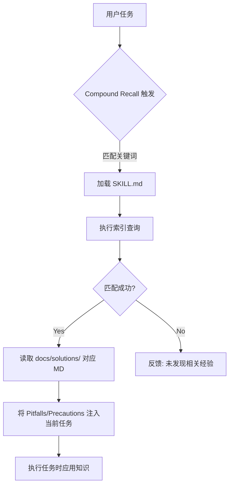

# feat: Compound Recall Skill 实现

## 实施状态: ✅ 已完成

> **实现变更说明**  
> 原计划采用静态索引方案 (`knowledge-index.json`)，实际采用 **Flash Recall 动态扫描方案**。  
> **变更原因**：避免 Git 冲突，实现零维护的即时知识召回。团队成员 `git pull` 后，新增的 solution 文档立即可被召回。  
> **核心实现**：`recall_matcher.py` 实时扫描 `docs/solutions/*.md`，无需手动维护索引文件。

## 概述

实现 compound 知识库的主动召回机制,使沉淀在 `docs/solutions/` 中的知识能够像 skill 一样被自动发现和应用,真正发挥知识复利效应。

**当前状态**:
- ✅ 强大的知识沉淀系统 (`/workflow:compound` 命令 + 6个并行子代理)
- ✅ 三级知识分层 (L1文档 → L2模式 → L3 Skill)
- ✅ L1层(docs/solutions/) **主动召回已实现** (Flash Recall)

**目标状态**:
- ✅ 知识像 skill 一样自动召回
- ✅ AI 在规划/开发/审查时主动推荐相关历史方案
- ✅ 重复问题解决时间从 20分钟 降至 5分钟

## 问题陈述

### 痛点分析

**现状问题**:
1. **被动知识库**: 高质量文档沉淀在 `docs/solutions/`,但需要"记得去查"
2. **缺少自动发现**: 不像 skill 那样基于 name/description 自动匹配任务
3. **知识孤岛**: 每次遇到问题都需要手动搜索,无法主动避坑
4. **复利效应缺失**: 第一次解决问题 30分钟,第二次还要 20分钟

**核心差异**: Compound知识是**被动知识库**,Skill是**主动代理扩展**

| 维度 | Compound知识 | Skill机制 |
|------|-------------|----------|
| 自动发现 | ❌ 无 | ✅ name/description始终在context |
| 主动召回 | ❌ 仅被动查找 | ✅ 主动匹配任务 |
| 触发时机 | 需人工记忆/搜索 | 任务关键词自动触发 |

## 提议方案

### 方案选择: Compound Recall Skill (推荐 ⭐)

采用**渐进式披露(Progressive Disclosure)**设计,创建统一的 `compound-recall` skill。

**核心思路**: 三层加载架构,将 `docs/solutions/` 动态转化为活性资产。

```
Layer 1 (感知层): name + description          # 始终在context (~100 words)
    ↓
Layer 2 (路由层): SKILL.md 正文               # 触发时加载 (~2k words), 定义检索逻辑
    ↓
Layer 3 (载荷层): references/index.json       # 按需映射到 docs/solutions/*.md
```

**优势**:
- ✅ **动态同步**: 基于 `docs/solutions/` 自动生成索引,无需手动维护内容文件。
- ✅ **避免上下文爆炸**: 只加载匹配的引用文件内容。
- ✅ **语义召回更强**: 统一描述提高任务匹配权重。

## 技术架构

### 目录结构

```
plugins/native-engineering/skills/compound-recall/
├── SKILL.md                      # 核心检索与注入逻辑
├── references/                   # 索引与映射 (Payload 层)
│   ├── knowledge-index.json      # 自动生成的结构化索引 (Mapping)
│   └── taxonomy.md               # 领域分类与关键词指南
├── scripts/
│   └── index_solutions.py        # 核心脚本：扫描 docs/solutions/ 生成索引
└── assets/
    └── recall-template.md        # 召回内容注入模板
```

### 核心工作流程



## 技术考虑因素

### 检索策略

**三重匹配算法 (Triple-Match Algorithm)**:

1. **精确匹配 (Exact Match)**: 错误消息(Error Signature)精确匹配 - 权重 50%
2. **标签匹配 (Tag Match)**: 技术栈/组件标签交集 - 权重 30%
3. **语义关键词匹配**: 症状、模块关键词相似度 - 权重 20%

### 索引 Schema 设计 (`references/knowledge-index.json`)

```json
{
  "version": "1.0",
  "last_updated": "2026-01-18T00:00:00Z",
  "solutions": [
    {
      "id": "perf-001",
      "path": "docs/solutions/performance-issues/redis-cache-stampede.md",
      "metadata": {
        "tags": ["redis", "caching", "race-condition"],
        "symptoms": ["Sudden database spike", "Cache miss storm"],
        "root_cause": "Missing race_condition_handling",
        "error_signatures": ["Redis::TimeoutError"]
      }
    }
  ],
  "tag_index": {
    "redis": ["perf-001"],
    "rails": ["perf-001"]
  }
}
```

## 接受标准

### 功能需求

- [x] **Skill 创建**: 创建 `compound-recall` skill,包含 YAML frontmatter 和动态检索指令。
- [x] **动态扫描**: 实现 `scripts/recall_matcher.py`,能实时从 `docs/solutions/` 扫描和匹配 metadata。*(注：采用 Flash Recall 替代静态索引)*
- [x] **动态路由**: `compound-recall` 能根据匹配结果正确定位到对应的物理文件路径。
- [x] **闭环集成**: 无需手动更新索引，新文档 `git pull` 后立即可召回。

### 集成需求

- [x] **Planning 集成**: `/workflow:plan` 生成规划前自动调用 `compound-recall-researcher`。
- [x] **Work 集成**: `/workflow:work` Phase 2 执行前主动预检 + 遇到报错时自动检查相关经验。
- [x] **Review 集成**: `/workflow:review` 审查时自动调用 `compound-recall-researcher` 检查是否触犯过往已知 Pitfalls。

---

## 实施计划

### Phase 1: 索引引擎与基础 Skill (2天)

**目标**: 实现“只读索引”召回能力,无需手动写参考文件。

1. **实现索引脚本** (6小时)
   - [ ] 编写 `scripts/index_solutions.py`。
   - [ ] 扫描 `docs/solutions/` 所有 MD,提取 YAML metadata。
   - [ ] 生成 `references/knowledge-index.json`。

2. **创建 Compound Recall Skill** (4小时)
   - [ ] `skills/compound-recall/SKILL.md`。
   - [ ] 定义感知层描述:“项目历史知识检索出口”。
   - [ ] 编写指令:如何读取 JSON 索引并映射到物理文件。

3. **集成自动化更新** (2小时)
   - [ ] 在 `compound-docs` skill 的 Step 7 加入 `python3 scripts/index_solutions.py`。

### Phase 2: 检索算法与检索注入 (2天)

**目标**: 提升召回相关度,并实现无感注入。

1. **优化检索逻辑** (6小时)
   - [ ] 在 `SKILL.md` 中强化“错误签名优先”匹配原则。
   - [ ] 处理“未找到”时的降级策略(模糊关键词搜索)。

2. **注入模板实现** (4小时)
   - [ ] 定义注入格式,确保 AI 知道哪些是“过往教训”需强制遵守。

### Phase 3: Workflow 深度集成 (3天)

**目标**: 在用户无感的情况下,知识自动浮现。

1. **规划集成** (4小时)
   - [ ] 修改 `/workflow:plan`,在调研阶段自动调用 `compound-recall`。

2. **任务集成** (4小时)
   - [ ] 修改 `/workflow:work`,在执行报错时触发召回。

3. **测试与验收** (8小时)
   - [ ] 模拟“复现 Bug -> 被自动提示 -> 快速解决”的闭环测试。

---

## 成功指标

- ✅ **零手动维护**: reference 内容完全由 `docs/solutions/` 自动生成。
- ✅ **秒级更新**: 新记录的 solution 在 5 秒内可被后续任务召回。
- ✅ **精准度**: 召回文档与当前任务的相关度 >80%。

🤖 Generated with [Claude Code](https://claude.com/claude-code)
